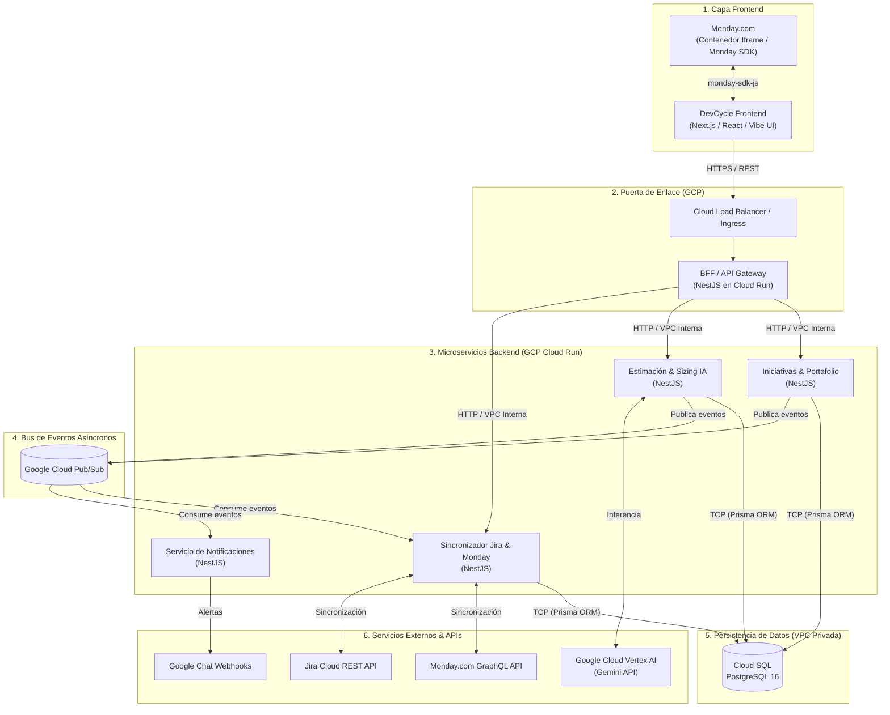

# DevCycle — Arquitectura Técnica a Alto Nivel

Diagrama y desglose técnico de componentes, flujo de datos e infraestructura para la solución productiva de DevCycle en Google Cloud Platform (GCP).

---

## 1. Diagrama de Arquitectura (Mermaid)

---

## 2. Componentes Técnicos

1. **Frontend (Next.js 16 + React 19 + Vibe UI):**
   - Interfaz web interactiva ejecutada como aplicación web moderna.
   - Funciona standalone o embebida dentro de Monday.com mediante `monday-sdk-js`.
   - Se comunica con el backend mediante llamadas seguras HTTPS REST contra el Gateway.

2. **BFF / API Gateway (NestJS en GCP Cloud Run):**
   - Único punto de entrada público para el backend.
   - Valida autenticación corporativa y contexto de Monday.
   - Enruta peticiones hacia los microservicios internos dentro de la red privada (VPC).

3. **Microservicios Backend (GCP Cloud Run):**
   - **`Iniciativas & Portafolio`:** Ciclo de vida de iniciativas (4 etapas macro), validación en Backlog TI y priorización visual.
   - **`Estimación & Sizing IA`:** Agente conversacional conectado a Gemini, cálculo de Hoja de Costos y VoBo dual.
   - **`Sincronizador Jira & Monday`:** Conexión bidireccional entre las épicas de Jira y los tableros de Monday.com.
   - **`Servicio de Notificaciones`:** Despacho de alertas a canales de Google Chat y correos corporativos.

4. **Bus de Eventos (Google Cloud Pub/Sub):**
   - Desacopla las operaciones pesadas (sincronizaciones, notificaciones y cálculos) de manera asíncrona y resiliente.

5. **Base de Datos (Cloud SQL PostgreSQL 16):**
   - Hospedada dentro de la VPC privada de GCP sin IP pública.
   - Conexión vía Serverless VPC Access Connector con transacciones ACID para garantizar consistencia en priorizaciones y aprobaciones.

6. **Servicios Externos:**
   - **Google Cloud Vertex AI (Gemini):** Motor para el chat inteligente de dimensionamiento técnico.
   - **Monday.com GraphQL API:** Publicación y lectura de tableros directivos.
   - **Jira Cloud API:** Creación y seguimiento de épicas e historias técnicas.
   - **Google Chat:** Alertas y notificaciones en tiempo real a los comités y directores.
