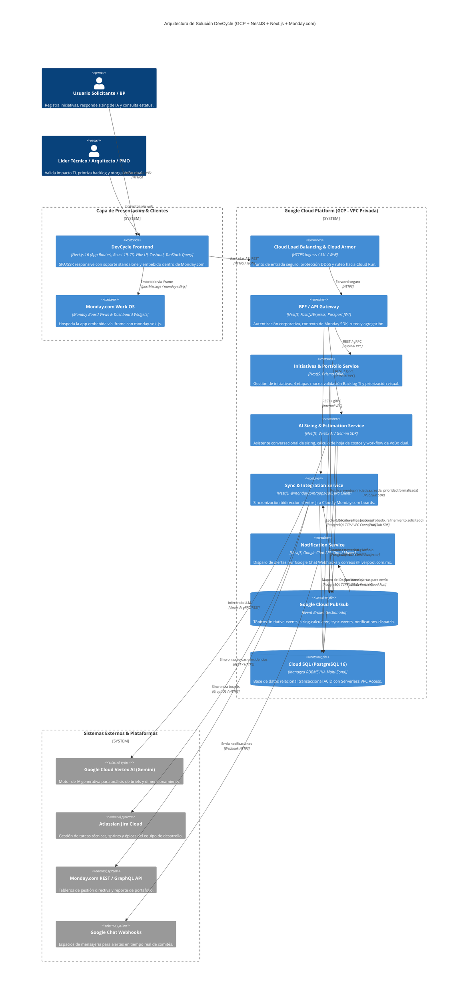
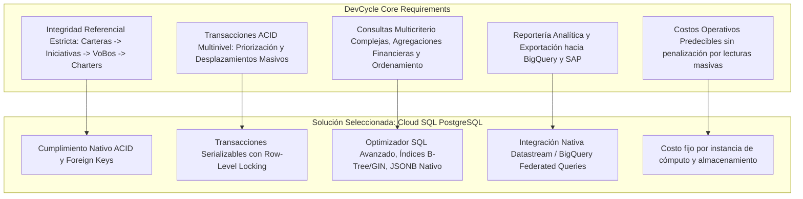

# DevCycle — Propuesta de Arquitectura Técnica de Microservicios

**Documento de Arquitectura de Solución**  
**Proyecto:** DevCycle Automatization (Liverpool)  
**Fecha:** Octubre 2026  
**Líder Técnico Frontend:** Javier Enrique Trejo Rodríguez

---

## 1. Visión General de la Arquitectura

DevCycle es la plataforma corporativa de Liverpool para unificar, automatizar y gobernar el ciclo de vida de iniciativas tecnológicas desde el descubrimiento (*Intake & Discovery*), pasando por la validación de impacto tecnológico (*Backlog TI*), la priorización estratégica multicriterio, la estimación asistida por Inteligencia Artificial (Gemini) y la doble aprobación técnica (Líder Técnico y Arquitectura), hasta la ejecución sincronizada en Jira y Monday.com.

Para soportar los requerimientos de alta disponibilidad (99.95% SLA), concurrencia elástica de usuarios corporativos, desacoplamiento de dependencias externas (Monday SDK, Jira REST API, Google Cloud APIs) y consistencia financiera estricta, se propone una **Arquitectura de Microservicios Serverless alojada en Google Cloud Platform (GCP)**.

---

## 2. Diagrama de Arquitectura de la Solución (Mermaid)

---

## 3. Catálogo de Microservicios Propuestos

Se propone una separación en **5 microservicios desacoplados** que corren de manera independiente como contenedores en **GCP Cloud Run**, garantizando escalabilidad a cero cuando no hay demanda y auto-escalado inmediato ante picos de comités o cierres trimestrales:

| Microservicio | Responsabilidad Principal | Tecnologías y Librerías NestJS Clave |
|---|---|---|
| **1. `bff-gateway-service`** | • Punto de entrada único para el Frontend. • Validación de JWT / SSO Liverpool. • Validación de sesión de Monday (`monday-sdk-js` token). • Rate limiting y agregación de respuestas. | `@nestjs/core`, `@nestjs/platform-express`, `@nestjs/passport`, `passport-jwt`, `@nestjs/throttler`, `helmet`, `class-validator`. |
| **2. `initiatives-portfolio-service`** | • Gestión del ciclo de vida de iniciativas (4 etapas macro). • Filtro y validación mandatoria de TI (`/backlog`). • Matriz de priorización visual y cálculo de desplazamientos. • Evaluación multicriterio y formalización de portafolio. | `@nestjs/common`, `@prisma/client`, `prisma`, `class-transformer`, `class-validator`, `@google-cloud/pubsub`. |
| **3. `ai-sizing-estimation-service`** | • Agente interactivo de dimensionamiento guiado (Gemini). • Procesamiento de requerimientos y extracción de variables técnicas (TPS, concurrencia, SLA). • Generación de Hoja de Costos (GCP Building API + Horas). • Workflow de VoBo dual (Líder Técnico + Arquitectura). | `@google/genai` (o `@google-cloud/vertexai`), `@nestjs/config`, `prisma`, `@google-cloud/pubsub`. |
| **4. `sync-integration-service`** | • Sincronización bidireccional entre Jira Cloud y Monday.com. • Mapeo de iniciativas a tableros de talento (horas hombre) y tableros directivos. • Recepción de webhooks de Monday y Jira. | `@mondaycom/apps-sdk`, `jira.js` (o `axios` con AxiosRetry), `@nestjs/microservices`, `@google-cloud/pubsub`. |
| **5. `notifications-service`** | • Despacho de notificaciones a espacios de Google Chat. • Generación de plantillas de correo `@liverpool.com.mx`. • Alertas automáticas ante cambios de prioridad o aprobaciones. | `@google-cloud/pubsub`, `nodemailer` / Internal SMTP Relay, `handlebars` (templates), `axios`. |

---

## 4. Patrones de Comunicación e Integración

### 4.1. Comunicación Síncrona (Inbound / Request-Response)
* **Frontend ➔ BFF Gateway:** Peticiones HTTPS / REST con autenticación Bearer Token y cabecera de contexto de Monday.
* **BFF Gateway ➔ Microservicios de Dominio:** Peticiones HTTP/2 internas dentro de la red privada (VPC de GCP). Cada Cloud Run tiene configurado Ingress restringido a *Internal and Cloud Load Balancing*, impidiendo acceso público directo a los microservicios internos.

### 4.2. Comunicación Asíncrona (Event-Driven con Google Cloud Pub/Sub)
Para garantizar resiliencia y desacoplar operaciones que consumen tiempo o interactúan con plataformas externas:
1. **Evento `initiative.created`:** Cuando negocio registra una iniciativa, se publica en Pub/Sub; el servicio de notificaciones avisa a la PMO para su validación en el Backlog TI.
2. **Evento `portfolio.formalized`:** Al formalizar el orden en `/priorizacion`, se publica el evento con la lista de iniciativas; `sync-integration-service` actualiza los tableros en Monday y `notifications-service` despacha las alertas a Google Chat.
3. **Evento `estimation.vobo_completed`:** Al recibir el VoBo dual, se dispara la creación automática del Charter y la sincronización con Jira.

---

## 5. Arquitectura de Base de Datos: Justificación Técnica de PostgreSQL vs. Firestore

Para la capa de persistencia transaccional central de DevCycle, se ha seleccionado **Google Cloud SQL for PostgreSQL 16**, descartando el uso de bases de datos documentales NoSQL como Google Cloud Firestore.

A continuación se detalla la justificación técnica objetiva:

### Tabla Comparativa Técnica: PostgreSQL vs. Firestore

| Criterio Técnico | Google Cloud SQL (PostgreSQL 16) | Google Cloud Firestore (NoSQL Document) | Impacto en DevCycle |
|---|---|---|---|
| **Modelo de Datos e Integridad** | **Relacional con Constraints Fuertes:** Claves foráneas, tablas normalizadas para iniciativas, etapas, criterios de evaluación, estimaciones y firmas de VoBo. | **NoSQL Basado en Documentos:** Desnormalización obligatoria. Las relaciones deben emularse en la capa de aplicación sin integridad referencial nativa. | **Crítico:** Si un usuario elimina o mueve una iniciativa, Firestore requiere lógica manual propensa a inconsistencias para actualizar referencias cruzadas de VoBos y evaluaciones. |
| **Transaccionalidad (ACID)** | **ACID Completo:** Soporta transacciones atómicas complejas sobre múltiples tablas con niveles de aislamiento configurables (Read Committed, Repeatable Read, Serializable). | **ACID Limitado:** Soporta transacciones sobre documentos individuales o grupos pequeños (máximo 500 escrituras por commit), sin soporte de bloqueos complejos de tabla. | **Crítico:** En la priorización visual, mover una iniciativa del lugar 15 al lugar 1 requiere desplazar 14 registros de forma atómica. En Firestore esto requiere transacciones complejas que pueden fallar por contención de concurrencia. |
| **Capacidad de Consulta y Filtros** | **SQL ANSI Completo:** `JOIN`, `GROUP BY`, agregaciones financieras (`SUM`, `AVG`), ordenamientos combinados sobre cualquier columna y soporte de `JSONB` indexable. | **Consultas Limitadas:** No soporta `JOINs`. Requiere índices compuestos manuales para cada combinación de filtros (`where` + `orderBy`) y no tiene agregaciones nativas complejas en tiempo real. | **Crítico:** DevCycle requiere filtrar dinámicamente por Cartera de Negocio + Etapa Macro + Estado Operativo + Rango de Score + Búsqueda de texto libre. En Firestore esto requiere crear decenas de índices compuestos rígidos. |
| **Evolución del Esquema y Migraciones** | **Esquema Tipado y Migraciones Seguras:** Migraciones estructuradas con herramientas como **Prisma Migrate** o **TypeORM**, garantizando contratos estrictos de datos. | **Schema-less:** La base de datos no valida la estructura. Los cambios de modelo deben gobernarse por código TypeScript, dejando datos antiguos heterogéneos. | **Alto:** Al estar en fase de prototipo transicionando a producto corporativo, los esquemas evolucionan constantemente; PostgreSQL asegura que no queden documentos rotos en base de datos. |
| **Reportería y Auditoría Corporativa** | **Integración Nativa con Data Warehouse:** Conexión directa mediante *Datastream for BigQuery* (Change Data Capture en tiempo real sin impacto) para BI y contraloría. | **Exportación Compleja:** Requiere exportar volcados a Cloud Storage y luego cargar en BigQuery, o implementar Cloud Functions por cada evento de escritura. | **Alto:** Liverpool requiere auditoría y reportería gerencial del portafolio hacia BigQuery y SAP Finance. PostgreSQL se conecta de manera nativa y directa. |
| **Estructura y Previsibilidad de Costos** | **Costo Fijo por Instancia:** Facturación basada en la capacidad aprovisionada de vCPU/RAM/Disco. El costo es 100% predecible independientemente del volumen de consultas. | **Costo por Operación (Pay-per-operation):** Facturación por cada documento leído, escrito y eliminado. Listar 100 iniciativas 50 veces por minuto en un comité dispara costos rápidamente. | **Medio-Alto:** En tableros donde decenas de personas de comités consultan y refrescan simultáneamente el portafolio, Firestore genera miles de lecturas facturables por minuto. |

### Conclusión de Persistencia
PostgreSQL proporciona la **rigurosidad relacional, consistencia ACID en la priorización atómica y capacidad analítica** que exige un sistema financiero y de gestión de portafolio corporativo. Además, mediante su tipo de datos `JSONB` nativo, PostgreSQL ofrece la misma flexibilidad de Firestore para almacenar atributos dinámicos (como respuestas de sizing y payloads del chat de IA) sin renunciar a la integridad referencial del núcleo del sistema.

---

## 6. Configuración de Conectividad y Seguridad en GCP

1. **Red Privada (VPC):** La instancia de Cloud SQL PostgreSQL no tendrá IP pública habilitada. Se comunica únicamente mediante IP privada utilizando **Private Service Access (PSA)**.
2. **Serverless VPC Access Connector:** Cada servicio en Cloud Run se conectará a la VPC a través de un conector Serverless, permitiendo que las llamadas a Cloud SQL viajen de forma 100% privada sin salir a Internet.
3. **Gestión de Secretos:** Las credenciales de base de datos, API Keys de Monday y credenciales de Jira se almacenarán en **Google Cloud Secret Manager**, inyectadas como variables de entorno a los contenedores de Cloud Run en tiempo de despliegue.
4. **Connection Pooling:** Uso de **Cloud SQL Auth Proxy** o PgBouncer embebido en la configuración de Prisma para manejar eficientemente la apertura y cierre de conexiones efímeras típicas de la arquitectura Serverless en Cloud Run.
